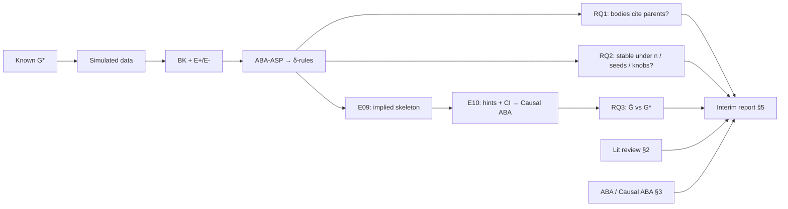

# Meta Understanding Plan — Morning Guide to `aa-plans/`

**Status:** living document. Last updated: 2026-05-24.
**Audience:** Sam (first deep read-through before implementation).
**Purpose:** Read the 15 planning specs in a sensible order, at the right level of abstraction, and leave with a coherent mental model plus a short list of changes (if any) before Session C (code).

**Start here.** Then follow the phases below. Do not read `experiments/E01`–`E10` in numeric order unless you already know the dependency graph.

---

## §0 — How to use this guide

### Two passes

| Pass | Goal | When |
|------|------|------|
| **A — Understand** | Follow Phases 1–7 in order; fill the parking lot lightly | This morning |
| **B — Challenge** | Re-read `EXPERIMENTS_PLAN` §4 (doctrine), `REPORT_OUTLINE` claim map, and every parking-lot row | Before Session C or before supervisor sign-off |

### Note-taking (one line per doc)

For each document, jot:

1. **This doc owns …** (one phrase).
2. **I would change …** (or “approve as-is”).

Keep a single `parking-lot` table (§5) open in your editor while you read.

### What to skim on Pass A

- YAML config stubs at the bottom of experiment specs (they matter for implementation, not for first understanding).
- `INFRA.md` §9 unit-test detail (unless you are about to implement tests).
- Appendix-only experiment specs (`E05`, `E08`) if time is tight.

### When to stop and ask questions

Recommended pause points: **end of Phase 1**, **end of Phase 3**, **end of Phase 5c** (RQ3 block).

---

## §1 — One-page mental model (~10 min)

### The project in one sentence

We show that **ABA-ASP learned rules** can characterise small known causal structures (RQ1–2) and **begin to serve as hints** for **Causal ABA** graph recovery (RQ3), with everything traceable to configs and `results.parquet` for the interim report.

### Pipeline



### Three layers of specs

| Layer | Documents | Answers |
|-------|-----------|---------|
| **Why** | `EXPERIMENTS_PLAN.md`, `REPORT_OUTLINE.md` | What we prove, to whom, which figures carry which claims |
| **How measure & run** | `METRICS.md`, `INFRA.md` | What a cell is; what is stored; how plots are regenerated |
| **What we run** | `experiments/E01`–`E10` | Grids, costs, pass criteria, dependencies |
| **Parallel (report)** | `LIT_REVIEW_NOTES.md` | How §2 gets written; does not block coding |

### Research questions (memorise these)

| RQ | One-line question | Interim “done” means |
|----|-------------------|----------------------|
| **RQ1** | Do δ-rule bodies cite true parents? | Case studies + body-parent F1 with named failure modes |
| **RQ2** | How sensitive is RQ1 to seeds, n, structure, knobs? | 30-seed bars, n-curves, structural view, binning + learner tables |
| **RQ3** | Do rule-hints help Causal ABA beyond CI alone? | E09 skeleton answered; E10 = 1 fig + 1 table + roadmap |

### Locked decisions (change only with intent)

- **30 seeds** per cell (not 20).
- **5 DGPs** (3×3-node + 2×4-node).
- **E09 answered**; **E10 preliminary** (not full benchmark).
- **Doctrine:** interim depth; every claim traceable; RQ3 code after RQ1–2 metrics stable.
- **Report:** 5k–10k words, 10–20 pp, 11 pt LaTeX (breadth OK).

### Explicit non-goals (do not “helpfully” expand scope)

Simulated only; ≤4 nodes; no full Causal ABA benchmark in interim; no real-world data in this phase.

---

## §2 — Reading order (the spine)

| Phase | Documents | Deep / Fast | Abstraction | Exit criterion (you can explain without notes) |
|-------|-----------|-------------|-------------|--------------------------------------------------|
| **1** | `EXPERIMENTS_PLAN.md` (§1–§8; skim §9–11) | 35 / 15 min | Highest | Three RQs, doctrine, P1–P4 gates, DGP zoo, defaults |
| **2** | `REPORT_OUTLINE.md` (§1–§6 + claim map) | 40 / 20 min | Report | Which figure/table supports which claim; §5 structure |
| **3** | `METRICS.md` (§2–§4, §6; skim §3.7–3.8) | 45 / 25 min | Measurement | Outcome categories; body-parent F1; two coverages; `fraction_solved` |
| **4** | `INFRA.md` (§1–§7, §10–11; skim §9) | 35 / 20 min | Machinery | One command → `results.parquet`; resume; cell = one learn run |
| **5a** | `E01` → `E02` → `E03` → `E04` | 50 / 25 min | Core runs | Execution order; E03 reuses E02 n=25; E04 = analysis only |
| **5b** | `E06` → `E07` | 30 / 15 min | Ablations | Why defaults; `subgrids`; BK permutation (E07c) |
| **5c** | `E09` → `E10` | 55 / 30 min | RQ3 | Skeleton vs bridge; D1/D2; E10 phases A–D; descope path |
| **5d** | `E05`, `E08` (skim) | 20 / 10 min | Appendix | Optional; noise + BK stress |
| **6** | `LIT_REVIEW_NOTES.md` | 30 / 15 min | Literature | §2 arc; reading list; parallel to implementation |
| **7** | §5 parking lot + §8 synthesis | 30 min | Integration | Change list or “approve”; ready for Session C? |

**Deep total:** ~4 h with breaks. **Fast total:** ~2 h (skip 5d, skim INFRA tests).

**Why not E01…E10 in order?** E04 is analysis-only; E09–E10 are RQ3; E05/E08 are appendix-bound. Dependency order matches `EXPERIMENTS_PLAN` §5.

---

## §3 — Per-document “owner” blurbs

Use as a map while reading; each doc still needs a real read in its phase.

| Document | This doc owns | Does not own | Read if you care about |
|----------|---------------|--------------|------------------------|
| **`meta-understanding-plan.md`** | Reading order, checks, parking lot | Any technical definition | *You are here* |
| **`EXPERIMENTS_PLAN.md`** | Vision, RQs, doctrine, phases, DGP zoo, risks, index | Formulas, YAML paths | Big picture, gates, defaults |
| **`REPORT_OUTLINE.md`** | Section structure, figures F1–F7, claim→evidence map | How to compute metrics | What the interim report must say |
| **`METRICS.md`** | Outcome categories, metric panel, aggregation rules, `metrics.py` shape | Runner CLI, directory tree | What “parent hit” means; coverage gap |
| **`INFRA.md`** | Runner, configs, `results.parquet`, resume, manifest, compute budget | Experiment hypotheses | Session C implementation |
| **`E01_sanity.md`** | Smoke + diff vs legacy tests; F2 case studies | Variance across seeds | P1 exit, “does new infra match old tests?” |
| **`E02_seed_robustness.md`** | 30×5 DGPs×targets @ n=25; F3 | n scaling | Main RQ2 variance |
| **`E03_sample_scaling.md`** | n grid; F4; reuse E02 @ n=25 | Structure comparison | Where elbow in n is |
| **`E04_structural_sweep.md`** | Analysis of E02; F5 | New Prolog runs | Chain vs fork vs collider vs hub |
| **`E05_noise.md`** | Noise scale sweep (appendix) | In-body claims | Gaussian SNR discussion |
| **`E06_binning.md`** | bins/strategy/split ablation; T1a | Learner budget | Justify continuous defaults |
| **`E07_learner_ablation.md`** | folding_steps/mode; BK order; T1b | Binning | “No solution” vs budget |
| **`E08_bk_content.md`** | Irrelevant cols + dropped parent (appendix) | Core RQ2 | Realistic BK noise |
| **`E09_implied_skeleton.md`** | Skeleton from δ-rules; PC/FC; D1/D2; F6 | Causal ABA API | First RQ3 answer |
| **`E10_bridge_to_causal_aba.md`** | Phases A–D; hints; F7/T2; roadmap | Full benchmark | Bridge prelim + descope |
| **`LIT_REVIEW_NOTES.md`** | §2 reading plan, templates, word budgets | Experiments | Literature review prose |

---

## §4 — Comprehension checks (self-test)

Answer aloud or in one sentence each. If stuck, re-read that phase’s docs.

### After Phase 1 (`EXPERIMENTS_PLAN`)

1. What is the difference between **RQ1** and **RQ3** in terms of output (rules vs graph)?
2. Why is **`completed_no_solution`** a first-class outcome, not a test failure?
3. Name the **five DGPs** and one sentence each on what makes them hard/easy.
4. What are the **three doctrine rules**?

### After Phase 2 (`REPORT_OUTLINE`)

1. Which **three figures** primarily support RQ2?
2. Pick one row in the **claim→evidence map** and trace it: claim → figure → experiment spec.
3. What is delivered for RQ3 in the interim vs post-interim?

### After Phase 3 (`METRICS`)

1. When is **`body_parent_recall`** NaN?
2. Why do we report **Python-Horn** and **Prolog-aware** coverage?
3. What is **`fraction_solved`** and when should a figure caption include it?
4. What is the difference between **off-graph** and **ancestor-only** hits?

### After Phase 4 (`INFRA`)

1. What four things must exist for a **claim in the report** (doctrine item 2)?
2. What makes a cell **“done”** on re-run?
3. Where do artefacts live vs where does the **aggregate table** live?

### After Phase 5a (E01–E04)

1. Why does **E03** not re-run all n=25 cells from scratch?
2. What does **E04** add that E02 already paid for?
3. What is **E01’s** role in the phase plan (P1)?

### After Phase 5b (E06–E07)

1. Why are E06/E07 **one-at-a-time** subgrids instead of one huge Cartesian product?
2. What is **`bk_permutation_seed`** testing?

### After Phase 5c (E09–E10)

1. What is **D2** in E09, and why must the report **not** sell it as discovery?
2. What is **E10 Phase A** exit criterion?
3. What happens to §5.3.2 if **R-E10-1** fires (API too hard)?

### After Phase 6 (`LIT_REVIEW_NOTES`)

1. What is the **narrative arc** of §2 in three bullets?
2. Which two papers are **★★ must-read** for our angle?

---

## §5 — Decision parking lot

Copy this table into your notes and fill as you read. Empty at end of morning = “approve spec as written.”

| ID | Topic | Current spec | My question / proposed change | Ripple (metrics / infra / report / compute) |
|----|-------|--------------|------------------------------|---------------------------------------------|
| D-1 | Wording: “recover parents” vs body-parent F1 | `METRICS.md` + `REPORT_OUTLINE` | | |
| D-2 | E09 **D2** uses G\* (diagnostic) | `E09`, captions | | |
| D-3 | E10 descope → skeleton-only narrative | `E10` §11, `REPORT_OUTLINE` §5.3.2 | | |
| D-4 | E03 compute (~25 h median) | `E03`, `INFRA` §11 | | |
| D-5 | Run **E02-disc** (discrete companion)? | `E02`, `E04` | | |
| D-6 | **Handcrafted** only in E01, not DGP zoo | `E01`, `EXPERIMENTS_PLAN` §7 | | |
| D-7 | | | | |
| D-8 | | | | |

**Pre-seeded rows** are suggestions from spec design — delete or resolve each before Session C.

When a row changes a default in `EXPERIMENTS_PLAN` §8, append to the **Decisions log** there.

---

## §6 — Map: experiment → RQ → figure → phase → Prolog?

| Exp | RQ | Report artefact | Phase gate | New Prolog cells? |
|-----|-----|-----------------|------------|-------------------|
| **E01** | smoke / RQ1 qual | F2, F-meth-1 | **P1 exit** | yes (~20) |
| **E02** | RQ2 | F3 | P2 | yes (~510) |
| **E03** | RQ2 | F4 | P2 | yes (~2550 new) |
| **E04** | RQ2 | F5 | P2 | **no** (analysis) |
| **E06** | RQ2 | T1a | P2 | yes (~1440) |
| **E07** | RQ2 | T1b, F-app-3 | P2 | yes (~2400) |
| **E09** | RQ3a | F6, F6b | P3 | baselines + analysis |
| **E10** | RQ3b | F7, T2 | P3 | bridge (~360) + Phase A investigation |
| **E05** | — (appendix) | F-app-4 | optional | yes (~720 new) |
| **E08** | — (appendix) | F-app-5/6 | optional | yes (~480 new) |

**Critical path to interim report body:** E01 → E02 → E03 → E04 → E06 → E07 → E09 → E10 (minimal).

---

## §7 — Relationship to code today

Specs describe what **Session C** will build; this is what exists **now**:

| Today | Maps to spec |
|-------|----------------|
| `causal/test_aba_learning.py` | E01-like runs; rich logs; not batchable |
| `causal/outputs/aba_learning/TestMinimal*` etc. | Legacy per-test artefacts |
| `causal/argcausaldisco_integration.py` | BK generation (INFRA `execute_cell`) |
| `causal/run_aba_asp.py` | Prolog runner (INFRA + Prolog-aware coverage) |
| `ArgCausalDisco/` simulators + **Causal ABA** | E02–E03 data; E10 Phase A |
| *Not yet:* `metrics.py`, `experiments/run_grid.py`, `configs/experiments/*.yaml` | METRICS + INFRA + all E* YAML stubs |

Reading specs **before** Session C is deliberate: you can still change grids and defaults cheaply.

---

## §8 — End-of-morning synthesis (~30 min)

### Checklist

- [ ] I can sketch the pipeline and three RQs from memory.
- [ ] I know which experiments must finish before **E09** and why.
- [ ] I know **P1 exit**: E01 + infra smoke (`EXPERIMENTS_PLAN` §5, `INFRA` §15).
- [ ] Parking lot is empty (**approve**) or has ≤8 rows with clear ripples.
- [ ] I know the next step: **Session C** (`metrics.py`, runner, E01 config) or **spec edits first**.

### Deliverable: “interim story” (5–10 bullets, your words)

Write bullets you could say to your supervisor in two minutes, e.g.:

- We characterise ABA-ASP on five small DGPs with 30 seeds …
- We treat no-solution as a result …
- We build an implied skeleton from rules (E09) …
- We begin bridging hints into Causal ABA (E10), with roadmap if API slips …

These bullets later become §1 of the report.

---

## §9 — Suggested schedule (optional)

| Block | Time | Phases |
|-------|------|--------|
| **A** | ~75 min | 1–2 — why + report shape |
| *break* | | |
| **B** | ~80 min | 3–4 — metrics + infra (densest) |
| *break* | | |
| **C** | ~85 min | 5a–5c — experiments (dependency order) |
| **D** | ~45 min | 5d (optional) + 6–7 — lit + synthesis |

Adjust freely; phases are the unit of progress, not clock time.

---

## §10 — After this morning

| Parking lot | Next action |
|-------------|-------------|
| **Empty / approve** | Agent mode **Session C**: `metrics.py` → Prolog coverage helper → `run_grid.py` → `E01_sanity.yaml` → smoke run |
| **Non-empty** | Edit affected specs in `aa-plans/` + decisions log → then Session C |
| **Supervisor questions** | Use `REPORT_OUTLINE` claim map + one E spec as evidence |

**Index of all plan files:**

```
causal/aa-plans/
├── meta-understanding-plan.md     ← you are here
├── EXPERIMENTS_PLAN.md            Phase 1
├── REPORT_OUTLINE.md              Phase 2
├── METRICS.md                     Phase 3
├── INFRA.md                       Phase 4
├── LIT_REVIEW_NOTES.md            Phase 6
└── experiments/
    ├── E01_sanity.md              Phase 5a
    ├── E02_seed_robustness.md     Phase 5a
    ├── E03_sample_scaling.md      Phase 5a
    ├── E04_structural_sweep.md    Phase 5a
    ├── E06_binning.md             Phase 5b
    ├── E07_learner_ablation.md    Phase 5b
    ├── E09_implied_skeleton.md    Phase 5c
    ├── E10_bridge_to_causal_aba.md Phase 5c
    ├── E05_noise.md               Phase 5d
    └── E08_bk_content.md          Phase 5d
```

---

*Good luck with the read-through. Challenge the parking lot honestly — that is cheaper than changing `metrics.py` twice.*
